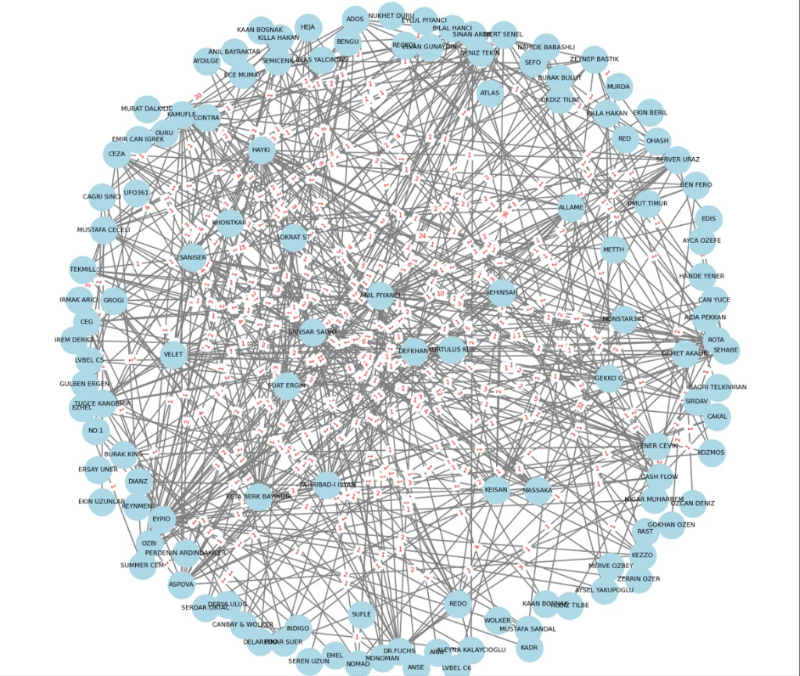
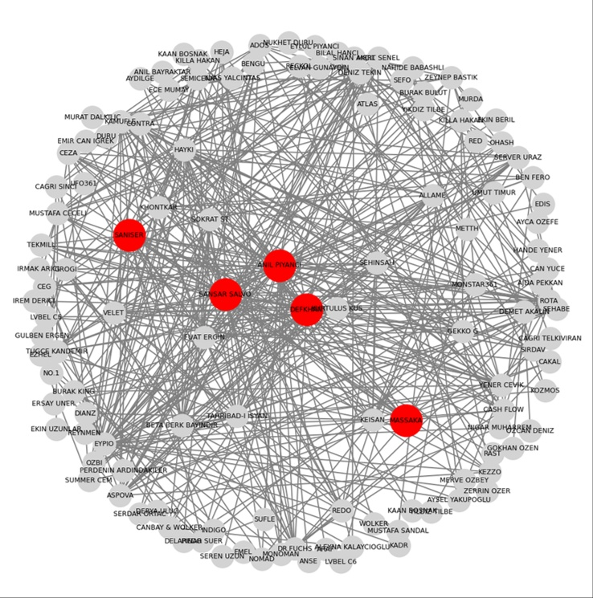
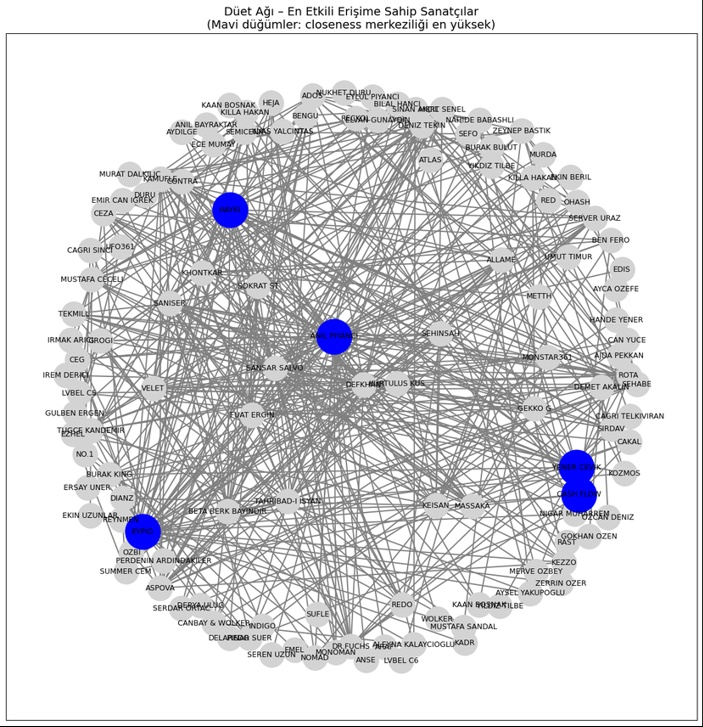
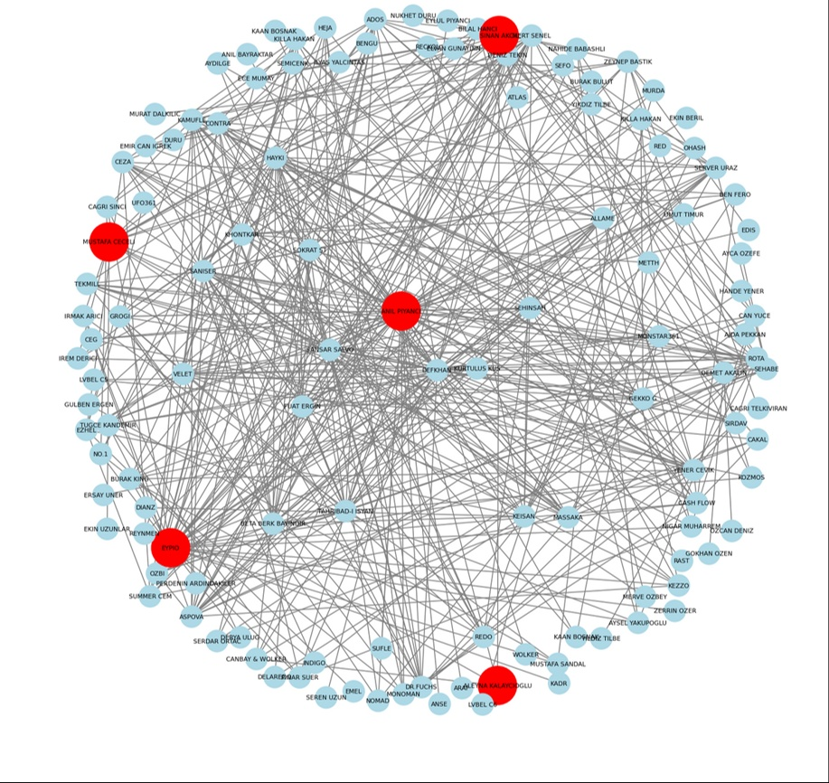
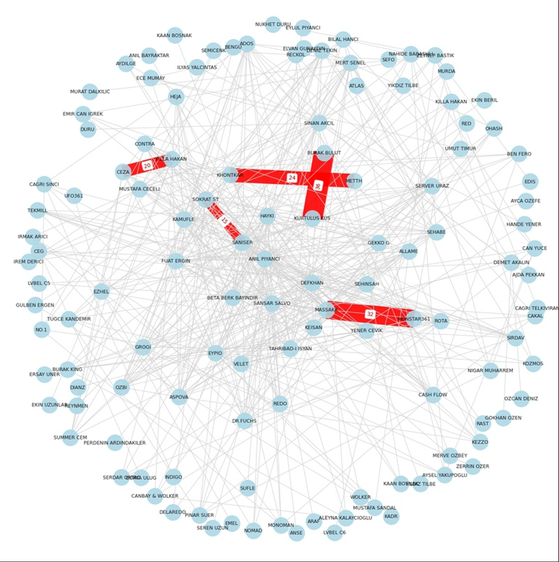
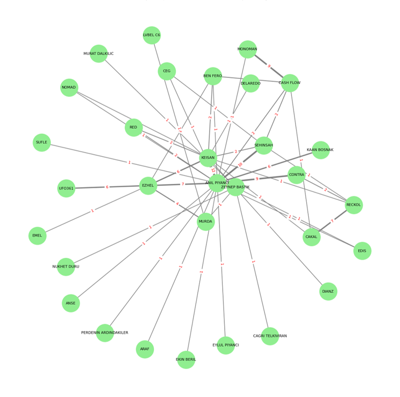

##Turkish Music Scene: A Social Network Analysis (SNA)

This project explores the collaborative landscape of the Turkish music industry, specifically focusing on the interactions between 124 Pop and Rap artists. By analyzing 485 unique duet relationships collected from Spotify, we reveal the underlying community structures and influential "bridge" actors that connect different musical genres.

##🧐 Overview

The goal of this study is to apply Graph Theory and Social Network Analysis to understand how artists collaborate and which individuals act as the primary "hubs" or "gatekeepers" in the industry.

##📊 Network Visualization

The visualization below represents the global interaction network. Each node is an artist, and each edge represents a duet.

##📈 Key Network Metrics & Centrality Analysis

We used several graph theory metrics to identify the most influential actors in the network.

1. Degree Centrality (The Collaboration Hubs)
   
Artists highlighted in red represent the most active collaborators. Anıl Piyancı stands out as the primary hub with 97 duets, followed by Massaka (67) and Şanışer (56).

2. Closeness Centrality (The Effective Reach)
   
Blue nodes indicate artists with the shortest average path to all other artists. These individuals can reach the entire network most efficiently.

Average Path Length: 3.04 (Small World Effect)

3. Betweenness Centrality (The Bridge Actors)
   
These artists act as "brokers" or bridges between different musical sub-genres (e.g., connecting Pop and Rap circles). Key bridges include Anıl Piyancı, Eypio, and Mustafa Ceceli.

##🔗 Deep Dive: Connection Strength & Communities

Strongest Collaborative Bonds

The thick red edges highlight the "Weighted" analysis, showing which artists work together most frequently. This reveals deep-rooted musical partnerships beyond one-off collaborations.

Community Structure (Louvain Algorithm)

We detected 7 distinct communities within the network. The visualization below shows a focused view of specific clusters (e.g., the Rap/Pop integration).

##🛠️ Methodology & Tools

Data Source: Manual extraction of collaboration data from Spotify.

Analysis: Python (NetworkX, Pandas).

Visualization: Matplotlib / Gephi layout logic.

Key Findings: The network exhibits a "Small World" phenomenon with high connectivity and specific central actors serving as industry gatekeepers.

## 👥 Project Team

This research was conducted as a collaborative effort by:
* **Merve Cingöz**
* **Şifanur Önal**
* **Sinem İncekara**
* **Ayşegül Uçar**

How to Run: Open the .ipynb file in Google Colab or Jupyter Notebook and run all cells. Ensure that the dataset .csv/.xlsx is in the same directory.
